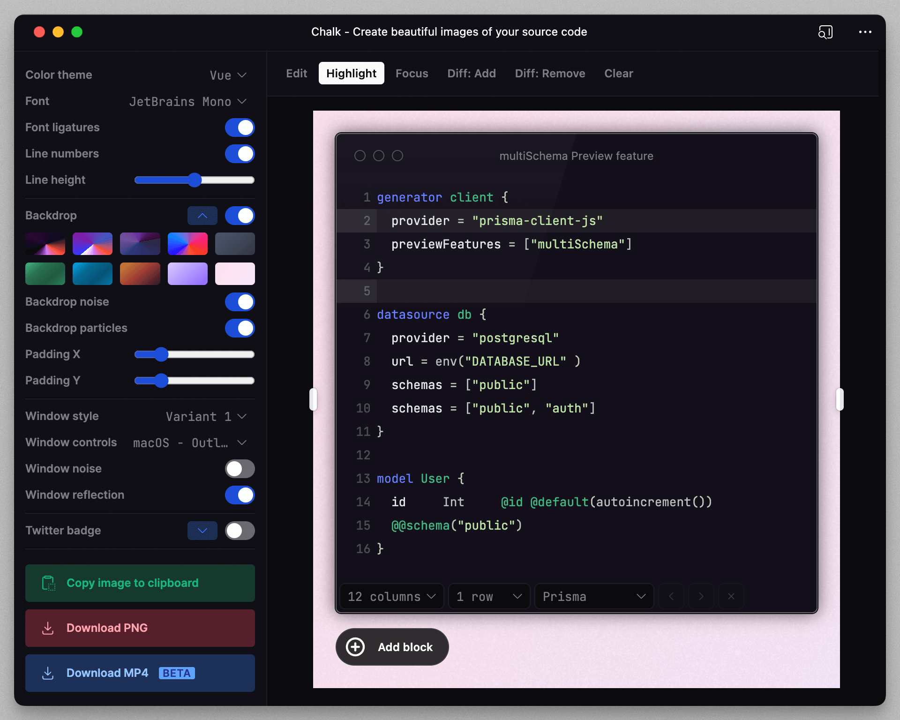

<h1 align="center">
Chalk.ist
</h1>

<p align="center">Create beautiful images of your source code</p>

<p align="center">
<a href="https://app.chalk.ist">Go to App</a>
</p>

[](https://chalk.ist)

## Development

```
pnpm install
```

```
pnpm run dev
```

## License

Inspired by [Dub](https://dub.co/), Chalk.ist is open-source under the GNU Affero General Public License Version 3 (AGPLv3) or any later version. You can [find it here](https://github.com/idered/chalk.ist/blob/main/LICENSE).
